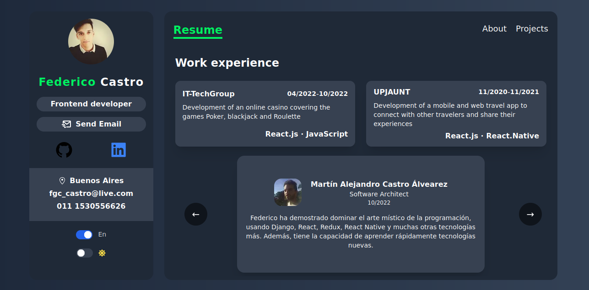

<h1 align="center"> Federico Castro </h1>

<h2 align="center"> 🚧 Project in continuous construction 🚧 <h2>

<p align="center">
    
    
    
    
    
</p>

<p align="center">
    
</p>

# 🛠️ Installation Steps

- ``` git clone https://github.com/FedericoGabrielCastro/portafolio.git ```

- ``` cd portafolio ```

- ``` yarn install ```

- ``` yarn run dev ```

***
<font color="green">
    <h1 align="center"> 
        <b>
            <i>
                <a href="https://portafolio-five-mu.vercel.app/" target="_blank">
                    🌴 Click here and go to the site 🌴
                </a>
            </i>
        </b>
    </h1>
</font>
